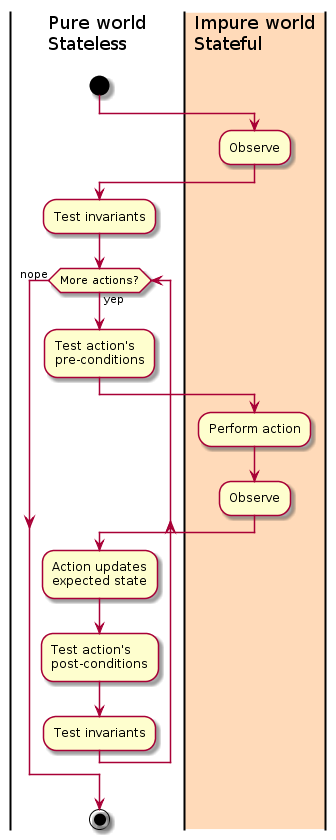
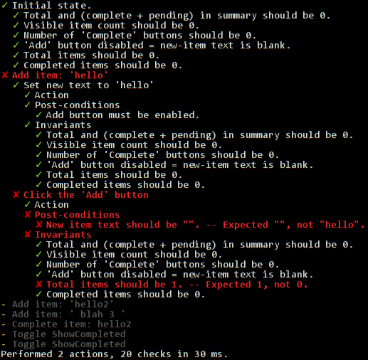

# Scala Test-State

Test stateful stuff statelessly, and reasonably.


# What is this?

Firstly, a quick mention of what this *is not*:

1. This is not a test *framework*.
   <br>Use it conjunction with ScalaTest, Specs2, μTest, etc.

1. This is not a property testing library.
   <br>Use it conjunction with ScalaCheck, Nyaya, ScalaProps, etc.

Ok, so what *is* this?
This is a library that:

1. Lets you write pure, immutable, referentially-transparent tests
   that verify stateful, effectful code or data.

1. Encourages composability of test concepts such as invariants/properties, pre/post conditions,
   dynamic actions/assertions, and more.

1. Makes test failure and inspection easy to comprehend.

### Uses

* Unit-test a webapp with Scala.JS.
* Test DB triggers, or a DB migration.
* Integration-test.
* Random-test (fuzz-test) like Android's `monkeyrunner` or ScalaCheck's `Command` API.
* UAT automation.


### Features

* Compiled for Scala & Scala.JS.
* Can run synchronously, asynchronously (`Future`) or in your own context-type (eg `Task`). Is stack-safe.
* Everything is immutable and composable.
* Combines property and imperative testing.
* Actions and assertions can be non-deterministic and/or dependent on runtime state.
* Tries to be as transparent and informative as possible about test execution.
* Optionally configurable error type. Use a custom ADT to precisely maintain all forms of failure and error in your domain.
* Includes a utility called `DomZipper` which greatly simplifies the task of HTML/SVG observation.
* Extension modules for various 3rd-party libraries. (Scalaz, Cats, more.)


# How does it work?

The key is to take **observations** of anything relevant in the stateful test subject.
Observations are like immutable snapshots.
They capture what the state was at a particular point in time.
Once an observation is captured, assertions are performed on it.

Optionally, you can specify some kind of test-only state that you modify as you test
and use to ensure the real-world observations are what you expect.
<br>For example, if you're testing a bank account app, you could maintain your own expected balance such that
when you instruct the app to make a deposit, you add the same amount to your state.
You could then add an invariant that whenever the balance is shown in the app, it matches the expected state balance.

This is a (simplified) model of how tests are executed:



Here is what the above looks like in action:



# How do I use this?

modules
deps
Create an object
types (Action etc)
types (FROSE)
create obs & dsl
create plan
run test

DSL

---


Doc
===

* How to use.
  * Setup. SBT & Exports.
  * Writing a test: Actions, checks, invariants.
  * Running a test.
* Operator/API reference.
* Example projects:
  * React TODO app. - domzipper, web, invariants, actions.
  * DB triggers.    - real external state, ref.
  * Mutable sample. - fuzz, invariants.
 What's available (modules).


Each time an action is performed, R→O then (S,O)→S.

Show example code & report BEFORE Usage.
Results before how.


# Usage

#### Project Setup

1. Choose your modules. Add to SBT.

1. Create an `object` for your config and select the functionality you want.

  ```scala
  package your.package

  object Testate
    extends testate.Exports
    // with testate.TestStateCats
    // with testate.TestStateNyaya
    // with testate.TestStateScalaz
    // with testate.domzipper.sizzle.Exports
  {
    // Additional config here if desired.
  }
  ```

#### Writing Tests

Maybe point to tutorial on blog and just have a reference here.
```
import
dsl
actions
checks before|after|around
invariants
plan -> test -> report -> assert
```

1. Import your config.
  ```scala
  import your.package.Testate._
  ```
1. Create a DSL.
  ```scala
  val dsl = Dsl[Reference, Observation, StateExpectations]
  ```
1. Create checks (and focuses).
  ```scala
  // Focuses
  val moneyRemaining = dsl.focus("Money remaining").value(_.obs.money)
  val columns        = dsl.focus("Columns").collection(_.obs.selCols)

  // Checks
  val noMoneyRemaining = moneyRemaining.assert.equal(0)
  val itemCountMatches = dsl.focus("Item count").obsAndState(_.count, _.items.size).assert.equal
  ```
1. Create invariants.
  ```scala
  val invariants =
    columns.assert.distinct &
    columns.assert.contains("Name") &
    moneyRemaining.test("isn't negative")(_ >= 0)
  ```
1. Create actions.
  ```scala
  def addMoney(amount: Int) =
    dsl.action("Add $" + amount)(_.ref.addTransaction(amount))            // Action
      .updateState(s => s.copy(expectedMoney = s.expectedMoney + amount)) // Adjust expected state

  // Add before-, after-, and around-conditions using +>
  val logout = (
    loggedInUser.assert.not.equal(None)     // Pre-condition
    +> dsl.action("Logout")(_.ref.logout()) // Action
    +> loggedInUser.assert.equal(None)      // Post-condition #1
    +> pageId.assert.change                 // Post-condition #2
  )

  // Compose actions using >>
  val example =
    login >> addMoney(100).times(3) >> logout
  ```
1. Create test.
  ```scala
  val plan = Plan(actions, invariants)
  val test = plan test Observer(...)
  ```
1. Run test.
  ```scala
  val report = test.run(initialExpectedState, reference)

  // Asserts that test passed. Throws an exception if failed.
  // Prints a report on pass and/or failure, when & how configurable via implicit settings.
  report.assert()
  ```


# Modules
| Module              | Description | Platforms |
|---------------------|-------------|-----------|
| `core`              | The core module. | Scala + Scala.JS. |
| `supp-scalaz`       | Support for [Scalaz](https://github.com/scalaz/scalaz). | Scala + Scala.JS. |
| `supp-cats`         | Support for [Cats](https://github.com/typelevel/cats). | Scala + Scala.JS. |
| `supp-nyaya`        | Support for [Nyaya](https://github.com/japgolly/nyaya). | Scala + Scala.JS. |
| `dom-zipper`        | Utility for observing web DOM.<br>*(Requires [jQuery](https://jquery.com/) or [Sizzle](https://sizzlejs.com/).)* | Scala.JS only. |
| `dom-zipper-sizzle` | As above bundled with [Sizzle](https://sizzlejs.com/). | Scala.JS only. |
